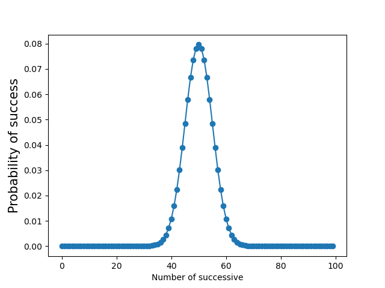
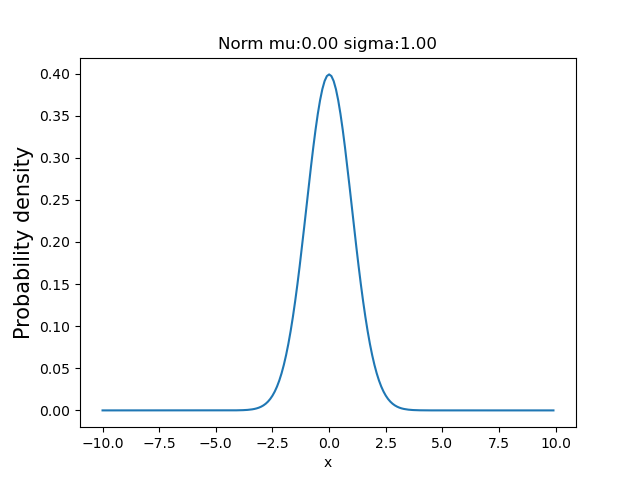

---

内容来源：  [智能搜索和推荐系统：原理、算法和应用](https://weread.qq.com/web/reader/8a2327707221fcb28a2649dkc81322c012c81e728d9d180)

# 1. 基本公理

## 1.1. 基本内容 略

## 1.2. 容易忘记的补充

1）互斥、互逆与独立性之间的关系：A与B互逆$\rightarrow$A与B互斥，反之不成立；A与B互斥（或互逆）且均非零概率事件$\rightarrow$A与B不独立。

    A与B互斥，则A与B不相容，即AB＝空集；如果A和B是逆，AB等于空集，A和B等于整个集合；
    A和B的互逆的互斥条件比A和B的互斥条件多，所以A和B是A和B的互斥子集。

2）若$A1，A2，…，Am；B1，B2，…，Bn$相互独立，则$f(A1，A2，…，Am)$与$g(B1，B2，…，Bn)$也相互独立，其中$f(A)、g(B)$分别表示对相应事件做任意事件运算后所得的事件。另外，概率为$1$（或$0$）的事件与任何事件相互独立。

## 1.3. 古典概率

$$ 
\lim _{N \rightarrow \infty} Q\left(A_{i}\right)=P\left(A_{i}\right) 
$$

## 1.4. 条件概率

$$P(A \mid B)=\frac{P(A B)}{P(B)}$$

$$
P(A B)=P(B) P(A \mid B)=P(A) P(B \mid A)
$$

推广到一般形式则有：

$$
P(A_1\cap A_2...\cap A_n) = P(A_1)P(A_2|A_1)P(A_3|A_1A_2)...P\left( A_n | \bigcap  _{i=1}^{n-1} A_i  \right)
$$

条件概率还满足以下性质

1. 如果事件$A_i$之间独立不相容，则：

$$
P\left(\sum_{i=1}^{\infty} A_{i} \mid B\right)=\sum_{i=1}^{\infty} P\left(A_{i} \mid B\right)
$$

2. 如果$A_i , A_j$ 条件独立, 则

$$
P\left(A_{i}, A_{j} \mid B\right)=P\left(A_{i} \mid B\right) P\left(A_{j} \mid B\right)
$$

## 1.5. 全概率公式

假设样本空间为$Ω$，试验的一组事件为${B1，B2，…，Bi}$，事件两两相斥，则

$$
B_{i} \cap B_{j}=\Phi(i \neq j ; i, j=1,2, \cdots, n) \text { 且 } \bigcup_{i=1}^{n} B_{i}=\Omega
$$

其中，$B1，B2，…，Bn$为样本空间Ω的一个划分。事件A的全概率公式为：

$$
P(A) = P(A\cap \bigcup \limits _{i=1}^n B_i)  = \sum \limits _{i=1} ^n P(AB_i) = \sum_{i=1}^nP(B_i)P(A|B_i)
$$ 

全概率公式的意义在于，当直接计算P(A)较为困难，而P(Bi)、P(A|Bi)(i=1，2，…)的计算较为简单时，可以利用全概率公式计算P(A)。

注意，对事件A进行分割，不是直接对A进行分割，而是先找到样本空间Ω的一个个划分小事件$B1，B2，…，Bn$，这样事件A就被事件$AB1，AB2，…，ABn$分解成了n部分，即$A=AB1+AB2+…+ABn$。在每一个小事件$Bi$中，事件A发生的概率是$P(A|Bi)$。

## 1.6. 贝叶斯公式

与全概率公式相反，贝叶斯公式是在条件概率的基础上寻找事件$B$发生的概率（即在大事件A已经发生的条件下，求分割中的小事件Bi发生的概率）。设$B1，B2，…，Bi$是样本空间$Ω$的一个划分，则对任一事件$A(P(A)>0)$有：

$$
P(B_i|A) = \frac{P(AB_i)}{P(A)} = \frac{P(B_i A)}{P(A)} = \frac{P(B_i)P(A|B_i)}{P(A)} = \frac{P(B_i)P(A|B_i)}{\sum \limits _{k=1}^nP(B_k)P(A|B_k)}
$$

贝叶斯公式也称朴素贝叶斯公式，P(Bi|A)为后验概率，P(Bi)为先验概率，P(A|Bi)为似然。在实际机器学习应用过程中，贝叶斯公式经常用到，全概率公式则很少用到。

> 例1：假设一个女孩天生聪明的概率是P(A)=1/10，一个女孩漂亮的概率是P(B)=1/10，一个女孩学习机器学习的概率是P(C)=1/100，求一个既聪明又漂亮的女孩学习机器学习的概率是多少？
> 
> 解：相互独立，$P(ABC) = P(A)\times P(B) \times P(C) = \frac{1}{10^4}$

> 假设一个女孩天生聪明的概率是P(A)=1/10，聪明的女孩子学习机器学习的概率是P(B|A)=1/1000，一个人学习机器学习的概率是P(B)=1/100，求一个学机器学习是聪明女孩的概率是多少？
> 
> 解： 
> $P(A) = \frac{1}{10}$  
> $P(B|A) = \frac{1}{1000}$
> $P(B) = \frac{1}{100}$
> $P(A|B) = \frac{P(AB)}{P(B)} = \frac{P(A)P(B|A)}{P(B)} = \frac{0.1\times 0.001}{0.01} = \frac{10^{-4}}{10^{-2}} = \frac{1}{100}$

# 2. 基础概率分布

## 2.1. 0-1分布

$$
P(X=k) = p^k(1-p)^{1-k}
$$

## 2.2. 二项分布

$$
\mathrm{P}(\mathrm{X}=\mathrm{k})=C_{n}^{k} p^{k}(1-p)^{n-k}, \mathrm{k}=0, \quad 1, \ldots, \mathrm{n}
$$

该公式可以理解为，在n次试验中有k次成功（成功的概率为p）和n–k次失败（失败的概率为1–p），并且k次成功可以在n次试验的任何次试验中出现，则k次成功分布在n次试验中共有[插图]种不同的排列组合。

[二项分布代码](prob_codes/二项分布.py)

效果图：

# 3. 

二项分布不断叠加后会产生一个重要的分布，就是正态分布。

## 3.1. 正态分布

$$
N(\mu,\sigma^2) =  \varphi(x)=\frac{1}{\sqrt{2 \pi} \sigma} \mathrm{e}^{-\frac{(x-\mu)^{2}}{2 \sigma^{2}}}, \sigma>0 ;-\infty<\mathrm{x}<+\infty
$$

[正态分布代码](prob_codes/正态分布.py)

# 4. 

## 4.1. 泊松分布

$$
P(X=k)=\frac{\lambda^{k}}{k !} e^{-\lambda}, \lambda>0 ; k=0,1,2 \ldots, n
$$

λ是单位时间（或单位面积）内随机事件的平均发生率，因此该分布适合描述单位时间内随机事件发生的次数。若随机变量X取0和一切正整数，在n次独立试验中出现的次数x恰为k次的概率为P(X=k)(k=0，1，...，n)，式中λ是一个大于0的参数，此概率分布称为泊松分布。它的期望值E(x)=λ，方差D(x)=λ。当n很大，且在一次试验中出现的概率P很小时，泊松分布近似二项分布。

## 4.2. 均匀分布

均匀分布由两个参数a和b定义，它们是数轴上的最小值和最大值，在边界a和b处的f(x)的值通常是不重要的。

$$
f(x)=\left\{\begin{array}{l}
\frac{1}{b-a}, a<x<b \\
0
\end{array}\right.
$$

## 4.3. 指数分布

$$
f(x)=\left\{\begin{array}{l}
\lambda \mathrm{e}^{-\lambda x}, x>0 ; \lambda>0 \\
0
\end{array}\right.
$$

其中，λ>0，常被称为频率参数，即单位时间内发生某事件的次数。指数分布的区间是[0，∞)。如果一个随机变量X呈指数分布，则可以写作X~Exponential(λ)。指数分布可以用来表示独立随机事件发生的时间间隔，比如旅客进机场的时间间隔、软件更新的时间间隔等。它是可靠性研究中最常用的一种分布形式。

## 4.4. 几何分布

$$
P(X=k)=(1-p)^{k-1} p, \quad 0<p<1, \quad k=1,2, \ldots
$$

在n次伯努利试验中，试验k次才得到第一次成功的概率，即前k–1次皆失败，第k次成功的概率。在伯努利试验中，成功的概率为p，x表示出现首次成功前的试验次数，x是离散型随机变量，只取正整数。

## 4.5. 超几何分布

$$
P(X=k)=\frac{C_{M}^{k} C_{N-M}^{n-k}}{C_{N}^{n},}  \quad {k=0,1, \ldots, \min (n, M)}
$$

在n次伯努利试验中，试验k次才得到第一次成功的概率，即前k–1次皆失败，第k次成功的概率。在伯努利试验中，成功的概率为p，x表示出现首次成功前的试验次数，x是离散型随机变量，只取正整数。

# 5. 期望 方差 标准差 协方差

试验中每次可能结果的概率乘以其结果的总和。对于离散型变量和连续型变量而言，其求解期望的方式如下所示

## 5.1. 期望

$$
\mathrm{P}\left\{\mathrm{X}=\mathrm{x}_{\mathrm{i}}\right\}=\mathrm{p}_{\mathrm{i}}, \quad \mathrm{E}(\mathrm{X})=\sum_{i} {x_{i} p_{\mathrm{i}}}
$$

$$
X \sim f(x), E(X)=\int_{-\infty}^{+\infty} x f(x) \mathrm{d} x
$$

期望代表了概率加权下随机变量的平均值。 

## 5.2. 方差

$$
\mathrm{D}(\mathrm{X})=\mathrm{E}[\mathrm{X}-\mathrm{E}(\mathrm{X})]^{2}=\mathrm{E}\left(\mathrm{X}^{2}\right)-[\mathrm{E}(\mathrm{X})]^{2}
$$

一个随机变量的方差描述的是它的离散程度，也就是该随机变量在其期望值附近的波动程度。方差是针对预测数据的，预测数据的离散程度越大，方差越大。方差示意图如图所示。

1. 标准差 
$$
\sqrt{D(X)}=\sqrt{E[X-E(X)]^{2}}
$$

2. 协方差

$$
\operatorname{Cov}(X, \quad Y)=E[(X-E(X)(Y-E(Y))]
$$

协方差是两个随机变量变化趋势的度量。若Cov(X，Y)>0，X、Y的变化趋势相同；若Cov(X，Y)<0，X、Y的变化趋势相反；若Cov(X，Y)=0，X、Y不相关。

# 6. 最大似然估计

假设样本是Xi={X1，X2，…，Xn}，未知的估计参数为θ，待优化的目标函数为：f(X1，X2，…，Xn|θ)。如果我们能从总样本中抽取几个样本的组合，使得样本组合的概率最大，那么参数估计问题就可以简单地转换成如下的最优化问题。

